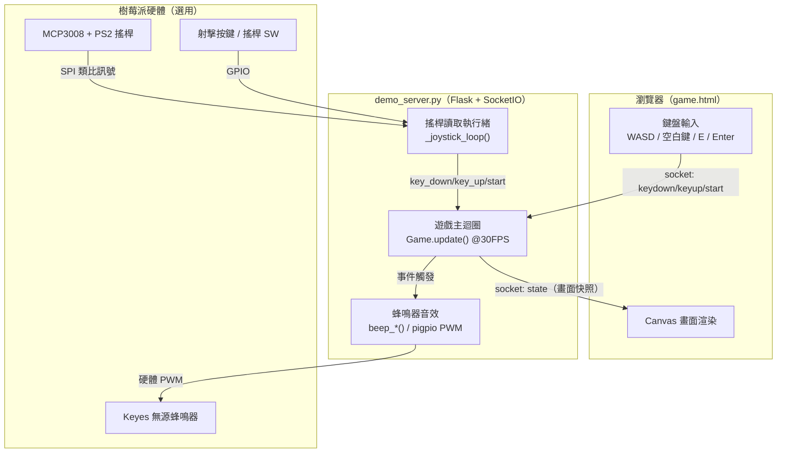
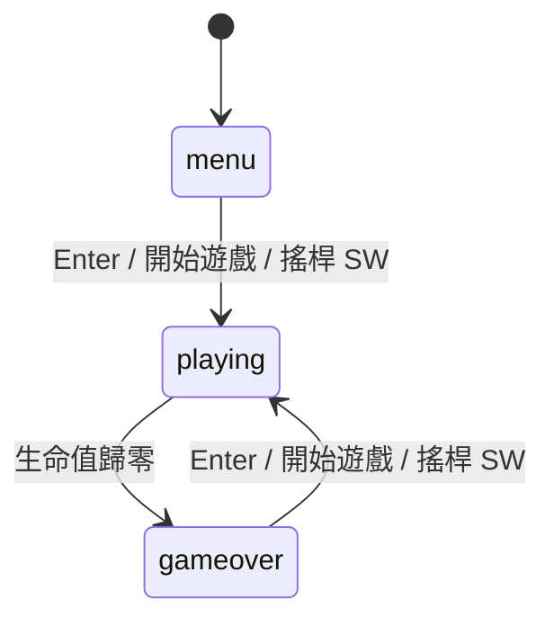

# ⚡ 雷霆戰機 Thunder Fighter

電腦或樹莓派皆可執行的網頁射擊遊戲，瀏覽器顯示畫面，支援鍵盤與樹莓派實體搖桿/蜂鳴器。

---

## 目錄

- [專案概述](#專案概述)
- [系統架構](#系統架構)
- [硬體需求](#硬體需求)
- [接線說明](#接線說明)
- [安裝與啟動](#安裝與啟動)
- [遊戲玩法](#遊戲玩法)
- [敵機種類](#敵機種類)
- [子彈種類](#子彈種類)
- [Buff 系統](#buff-系統)
- [專案結構](#專案結構)

---

## 專案概述

| 項目 | 說明 |
|------|------|
| 平台 | 電腦（Windows/macOS/Linux）或 Raspberry Pi 4B |
| 語言 | Python 3.10+ |
| 後端 | Flask 3.x + Flask-SocketIO |
| 前端 | HTML5 Canvas + JavaScript |
| 音效 | Keyes 無源蜂鳴器（pigpio 硬體 PWM，僅樹莓派） |

**單一執行入口：** `demo_server.py`

> 在樹莓派上執行且接好搖桿/蜂鳴器時，會自動啟用實體搖桿輸入與音效；
> 在電腦上執行時偵測不到對應硬體，會自動停用，僅用鍵盤操作、無聲音，不影響遊戲。
> 蜂鳴器需先在樹莓派上執行 `sudo pigpiod`（BUZZER_PIN=18）。

---

## 系統架構



> 在電腦上執行時，沒有 MCP3008/搖桿/蜂鳴器硬體，`Joystick` 與 `Buzzer` 會自動偵測失敗並停用，僅保留鍵盤與畫面渲染的路徑。

---

## 硬體需求

> 以下硬體僅樹莓派需要，電腦執行純鍵盤版本不需任何硬體。

| 元件 | 規格 |
|------|------|
| 微控制器 | Raspberry Pi 4B |
| 音效 | Keyes 無源蜂鳴器 |
| 控制器 | PS2 搖桿模組 |
| ADC | MCP3008（SPI 介面，搖桿類比轉換） |
| 射擊按鍵 | 常開型按鍵（NO Push Button） |

---

## 接線說明

### MCP3008 ↔ Raspberry Pi（SPI0）

| MCP3008 | Raspberry Pi | BCM |
|---------|-------------|-----|
| VDD / VREF | 3.3V | — |
| AGND / DGND | GND | — |
| CLK | SCLK | 11 |
| DOUT | MISO | 9 |
| DIN | MOSI | 10 |
| CS/SHDN | CE0 | 8 |

### PS2 搖桿 ↔ MCP3008

| 搖桿 | MCP3008 | 說明 |
|------|---------|------|
| VRx | CH0 | X 軸 |
| VRy | CH1 | Y 軸 |
| VCC | 3.3V | 電源 |
| GND | GND | 接地 |
| SW | RPi BCM 24 | 導彈按鈕 |

### 其他元件 GPIO（BCM）

| 元件 | BCM 腳位 |
|------|---------|
| 射擊按鍵 | 23 |
| 蜂鳴器（PWM） | 18 |

> 使用前請啟用 SPI：`sudo raspi-config` → Interface Options

---

## 安裝與啟動

### 電腦 Demo 版（不需硬體）

```bash
pip install flask flask-socketio eventlet
python demo_server.py
# 瀏覽器開啟 http://localhost:5000
```

### 樹莓派版（搖桿 + 蜂鳴器）

```bash
# 啟用 pigpio daemon（無源蜂鳴器需要）
sudo pigpiod

# 安裝套件
pip install -r requirements.txt

# 啟動遊戲
python demo_server.py
# 瀏覽器開啟 http://<樹莓派IP>:5000
```

---

## 遊戲玩法

### 鍵盤操作

| 按鍵 | 動作 |
|------|------|
| WASD / 方向鍵 | 移動飛機 |
| 空白鍵 | 連續射擊 |
| E | 發射導彈（清除畫面所有非 Boss 敵機） |
| Enter | 開始 / 重新開始 |

### 搖桿操作（樹莓派）

| 硬體 | 動作 |
|------|------|
| 搖桿 上下左右 | 移動飛機 |
| 射擊按鍵（BCM 23） | 連續射擊 |
| 搖桿 SW（BCM 24） | 遊戲中：發射導彈；未開始/結束畫面：開始 / 重新開始 |

> 每次啟動時自動校正搖桿中心點（約 1 秒），請保持搖桿靜止。

### 遊戲狀態流程



### 遊戲規則

- 初始生命值：**5 條**
- 被敵機子彈擊中扣 1 條生命，同時進入 **2 秒無敵**
- 每 1500 分升一關，難度遞增
- 每 3 關出現一隻 Boss
- 導彈最多持有 3 枚，每 15 秒自動補充 1 枚
- 擊殺敵機有 25% 機率掉落 Buff

---

## 敵機種類

| 種類 | 移動方式 | 射擊類型 | 擊殺分數 |
|------|---------|---------|---------|
| 偵察機 Scout | 直衝向下 | 不射擊 | 50 |
| 戰鬥機 Fighter | 左右掃蕩 | 普通追蹤彈 | 100 |
| 轟炸機 Bomber | 左右掃蕩 | 3 發扇形散射 | 200 |
| 蛇形機 Zigzag | 正弦波移動 | 高速雷射 | 150 |
| Boss | 左右掃蕩 | 追蹤彈（免疫導彈） | 500 |

---

## 子彈種類

### 玩家子彈

| 種類 | 說明 |
|------|------|
| 普通彈 | 直線向上，子彈列數可升至 3 列 |

### 敵機子彈

| 種類 | 使用敵機 | 特性 |
|------|---------|------|
| 普通彈 | 戰鬥機 | 朝玩家方向直線飛行 |
| 散射彈 | 轟炸機 | 同時射出 3 發扇形（±25°） |
| 雷射 | 蛇形機 | 極速直線向下 |
| 追蹤彈 | Boss | 慢速但持續轉向玩家（有效追蹤距離 180px） |

所有敵機子彈圖片依飛行方向自動旋轉。

---

## Buff 系統

擊殺敵機有 25% 機率掉落 Buff，飛機飛過自動撿取。

| Buff | 效果 | 持續時間 |
|------|------|---------|
| 🛡 減傷 | 下次被擊中免傷一次 | 單次 |
| ❤ 補血 | 恢復 1 條生命（上限 5） | 永久 |
| ⚡ 攻擊↑ | 傷害 ×2 | 10 秒 |
| 💠 子彈↑ | 子彈列數 +1（上限 3 列） | 永久 |
| 🔥 傷害↑ | 基礎傷害 +1 | 10 秒 |
| 🚀 導彈 | 補充 1 枚導彈 | 永久 |

---

## 專案結構

```
thunder_fighter/
├── demo_server.py       # 遊戲主程式（Flask + SocketIO，含搖桿/蜂鳴器支援）
├── requirements.txt     # 樹莓派版套件需求（含搖桿/蜂鳴器套件）
├── requirements_demo.txt# 電腦版套件需求
├── static/
│   └── img/             # 遊戲圖片素材
├── templates/
│   └── game.html        # 遊戲頁面
└── README.md
```
